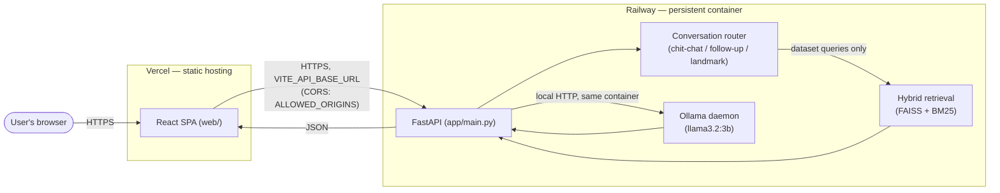

# MANARA

A bilingual (Arabic/English) Retrieval-Augmented Generation assistant for UAE geospatial data — Sentinel-2 satellite imagery metadata, OpenStreetMap road networks, and derived analytics.

- **`app/`** — FastAPI backend: language detection → intent/entity extraction → hybrid (FAISS + BM25) retrieval → LLM generation (Ollama, `llama3.2:3b`).
- **`web/`** — React 19 + Vite + Tailwind frontend: chat interface, retrieval inspector, sources panel, interactive map.

See `CLAUDE.md` for the detailed local development / architecture reference.

## Local development

```bash
# Backend (from repo root)
uvicorn app.main:app --reload

# Frontend
cd web && npm run dev
```

Requires [Ollama](https://ollama.com) running locally with `llama3.2:3b` pulled, and the FAISS index / search corpus already built (see `CLAUDE.md`'s data pipeline section).

## Deployment

MANARA runs two independently-deployed pieces:

| Component | Platform | Why |
|---|---|---|
| Backend (`app/`) | [Railway](https://railway.app) | Runs `llama3.2:3b` via Ollama locally in-process — needs a persistent container with real RAM, not scale-to-zero serverless. Deploys straight from this GitHub repo via Railway's dashboard (no local CLI needed). |
| Frontend (`web/`) | [Vercel](https://vercel.com) | Static Vite build, deploys from the same repo, generous free tier, automatic HTTPS. |

### Backend — Railway

1. On [railway.app](https://railway.app), **New Project → Deploy from GitHub repo** → select this repo.
2. Railway detects the root `Dockerfile` and `railway.json` automatically (build: Docker; health check: `/health`).
3. Set the **Root Directory** to the repo root (the Dockerfile expects to build from there, not from `app/`).
4. Add the environment variable below (`ALLOWED_ORIGINS`) once you know your Vercel URL — see [Environment Variables](#environment-variables).
5. Deploy. First build pulls the ~2GB `llama3.2:3b` model during the Docker build (see `Dockerfile`) — expect a longer first build than usual.
6. Note the generated `*.up.railway.app` URL (or attach a custom domain) — this is your backend URL.

### Frontend — Vercel

1. On [vercel.com](https://vercel.com), **Add New Project** → import this repo.
2. Set **Root Directory** to `web/`.
3. Framework preset: Vite (auto-detected). Build command / output directory are already configured in `web/vercel.json`.
4. Add the `VITE_API_BASE_URL` environment variable (see below), pointing at your Railway backend URL.
5. Deploy. Note the generated `*.vercel.app` URL.

### After both are deployed

Go back to the Railway service and set `ALLOWED_ORIGINS` to your real Vercel URL (CORS is locked to specific origins, not wildcarded), then redeploy the backend so it picks up the new value.

## Environment variables

### Backend (Railway)

| Variable | Required | Default | Purpose |
|---|---|---|---|
| `ALLOWED_ORIGINS` | Recommended in production | `http://localhost:5173,http://127.0.0.1:5173` | Comma-separated list of origins allowed to call the API (CORS). Set to your Vercel URL. |
| `COPERNICUS_USERNAME` / `COPERNICUS_PASSWORD` | No | — | Only used by the offline data-pipeline scripts (`scripts/download_*`), not by the running API. Not needed to deploy. |
| `PORT` | No (injected by Railway) | `8000` | The port `uvicorn` binds to — Railway sets this automatically; `entrypoint.sh` respects it. |

### Frontend (Vercel)

| Variable | Required | Default | Purpose |
|---|---|---|---|
| `VITE_API_BASE_URL` | Yes, in production | `/api` (relies on the local Vite dev proxy) | Base URL of the deployed backend, no trailing path — the client appends `/query` itself. |

See `.env.example` (backend) and `web/.env.example` (frontend) for copy-pasteable templates.

## Production architecture



Both services get HTTPS automatically from their respective platforms (Vercel and Railway both terminate TLS for you — no certificate management needed).
